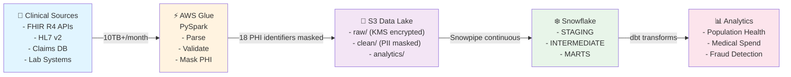
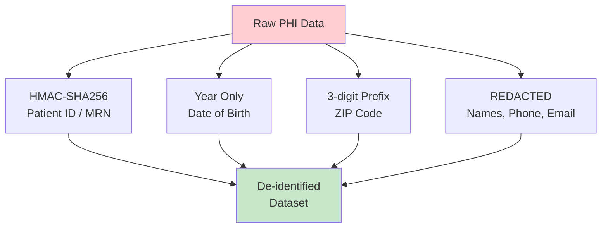
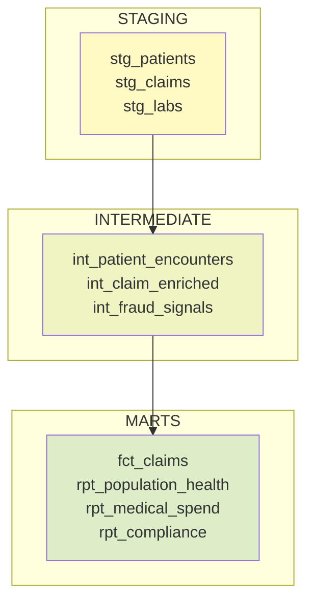
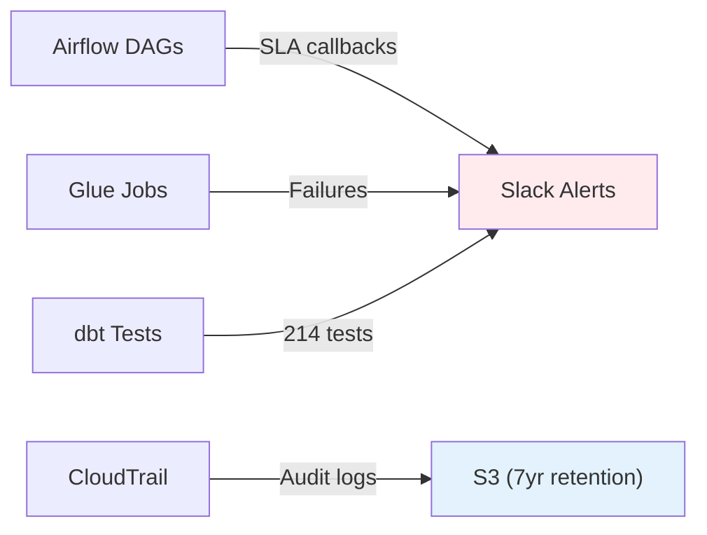

# Healthcare Analytics Platform - Architecture Diagrams

## System Flow

```mermaid
graph LR
    A["🏥 Clinical Sources<br/>- FHIR R4 APIs<br/>- HL7 v2<br/>- Claims DB<br/>- Lab Systems"]
    B["⚡ AWS Glue<br/>PySpark<br/>- Parse<br/>- Validate<br/>- Mask PHI"]
    C["🔐 S3 Data Lake<br/>- raw/ (KMS encrypted)<br/>- clean/ (PII masked)<br/>- analytics/"]
    D["❄️ Snowflake<br/>- STAGING<br/>- INTERMEDIATE<br/>- MARTS"]
    E["📊 Analytics<br/>- Population Health<br/>- Medical Spend<br/>- Fraud Detection"]

    A -->|10TB+/month| B
    B -->|18 PHI identifiers masked| C
    C -->|Snowpipe continuous| D
    D -->|dbt transforms| E

    style A fill:#e1f5ff
    style B fill:#fff3e0
    style C fill:#f3e5f5
    style D fill:#e8f5e9
    style E fill:#fce4ec
```

## PII Masking Strategy

```mermaid
graph TB
    A["Raw PHI Data"] --> B["HMAC-SHA256<br/>Patient ID / MRN"]
    A --> C["Year Only<br/>Date of Birth"]
    A --> D["3-digit Prefix<br/>ZIP Code"]
    A --> E["REDACTED<br/>Names, Phone, Email"]

    B --> F["De-identified<br/>Dataset"]
    C --> F
    D --> F
    E --> F

    style A fill:#ffcdd2
    style F fill:#c8e6c9
```

## dbt Layer Architecture

```mermaid
graph TB
    subgraph "STAGING"
        A["stg_patients<br/>stg_claims<br/>stg_labs"]
    end

    subgraph "INTERMEDIATE"
        B["int_patient_encounters<br/>int_claim_enriched<br/>int_fraud_signals"]
    end

    subgraph "MARTS"
        C["fct_claims<br/>rpt_population_health<br/>rpt_medical_spend<br/>rpt_compliance"]
    end

    A --> B
    B --> C

    style A fill:#fff9c4
    style B fill:#f0f4c3
    style C fill:#dcedc8
```

## Monitoring and Alerting

```mermaid
graph LR
    A["Airflow DAGs"] -->|SLA callbacks| D["Slack Alerts"]
    B["Glue Jobs"] -->|Failures| D
    C["dbt Tests"] -->|214 tests| D
    E["CloudTrail"] -->|Audit logs| F["S3 (7yr retention)"]

    style D fill:#ffebee
    style F fill:#e3f2fd
```
